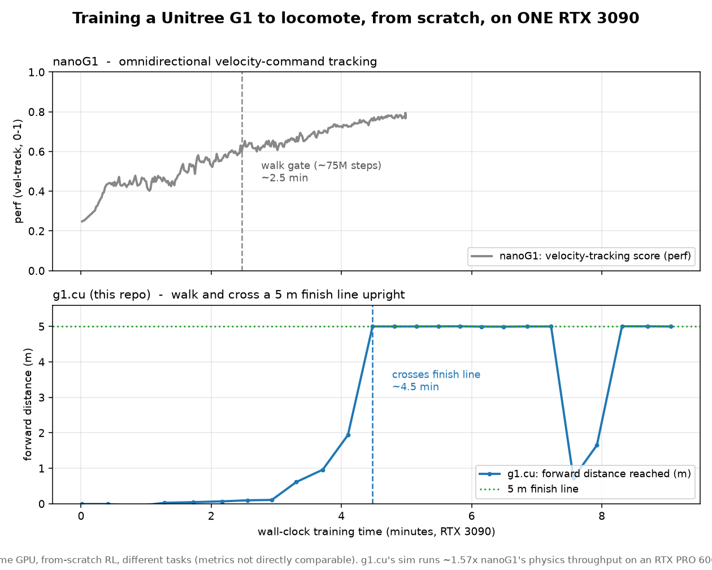

# g1.cu


A hyperspecialized, fully-fused GPU simulator and on-GPU reinforcement-learning loop for the
Unitree G1 humanoid, running on a single consumer GPU (RTX 3090, sm_86, CUDA 13.x).

The entire RL training rollout — rigid-body physics, foot-ground contact solve, policy-network
inference, action sampling, and reward — runs in **one persistent CUDA kernel**. No per-step
CPU↔GPU round-trips, no cuBLAS. PPO gradient updates run in PyTorch, reading the trajectory
buffers in place. It trains a G1 to walk across a 5 m finish line in **~3–4 minutes**.

## Honest framing (read this first)

This is a research POC, not a breakthrough. Training a legged robot to walk in minutes on one
GPU is the established result behind massively-parallel RL — see Isaac Gym and *"Learning to
Walk in Minutes Using Massively Parallel Deep RL"* (Rudin et al., 2021). General GPU RL-physics
engines (Isaac Lab, MuJoCo MJX, Brax, NVIDIA Warp, Genesis) are mature and, unlike this one,
reusable across arbitrary robots.

What this repo explores is the opposite axis — **hyperspecialization**: a hand-written sim for
ONE robot and ONE contact regime (foot-ground), with the physics *and* the policy fused into a
single megakernel. The closest prior art for hyperspecialized batched GPU simulators is Madrona
(Stanford, 2023), which fuses the *simulation* into a megakernel; here the *policy inference* is
fused in as well. Measured honestly, that fusion contributes little on its own (~1.09×); the
real speed comes from a specialized, spill-minimized contact solve. The value here is the
MuJoCo-validated specialized kernel and the measured, no-hype engineering — not a new capability.

## Results (RTX 3090, measured)

| metric | value |
|---|---|
| Physics throughput, foot-ground contact (N=8192) | ~3.2e6 substeps/s |
| vs MJX full-physics, same GPU (foot-ground)\* | ~10× |
| Fused training rollout (N=8192, H=32, 10 substeps) | 528 ms (4.96e6 substeps/s) |
| Rollout speedup vs host-orchestrated loop | 2.05× |
| Train G1 to cross a 5 m finish line | ~250 PPO iters, ~3–4 min |

\* Apples-to-oranges caveat: this solves only foot-ground contacts (8 foot spheres vs a floor
plane); MJX simulates the full self-collision set. The ~10× is honest only for the
locomotion-relevant contact set, not identical physics.

## vs nanoG1 (same GPU)

[nanoG1](https://github.com/kingjulio8238/nanoG1) is a contemporaneous from-scratch G1 walker on a
specialized GPU MuJoCo engine. Measured on the same hardware:

- **Sim throughput (RTX PRO 6000, Blackwell sm_120):** g1.cu **1.53e7** vs nanoG1 **9.75e6**
  physics-steps/s = **~1.57×**, after a +24% Blackwell frame-reduction pass (one-thread-per-world
  is local-memory-bandwidth bound; cutting the per-thread frame converts ~1:1 to throughput — full
  campaign with every dead end in [`DEVLOG.md`](DEVLOG.md), 2026-06-18).
- **Training (RTX 3090, from scratch):** both train a G1 to locomote in single-digit minutes.
  The tasks differ — nanoG1 does omnidirectional velocity-command tracking; g1.cu walks across a
  5 m finish line and must stay upright the whole way — so the curves are stacked, not overlaid:



Honest split: g1.cu has the faster **simulator**, but nanoG1 reaches its goal in less wall-clock
**training** time (~2.5 min to its walk gate vs ~4.5 min to our finish line) — its edge is
sample efficiency (symmetry loss, V-trace, a tuned PufferLib trainer), not sim speed.

A demo of the trained g1.cu walker crossing the line:
[`demo/g1_finish_demo.mp4`](demo/g1_finish_demo.mp4).

## Validation

The physics is checked bit-for-bit against MuJoCo:

- forward dynamics (Featherstone ABA) vs MuJoCo `qacc`: relerr ~2e-5
- bias force (RNE, qacc=0) vs MuJoCo `qfrc_bias`: bit-identical
- foot-ground contact solve vs a MuJoCo-matched fp64 PGS oracle: relerr ~2e-5
- every kernel optimization is gated against a frozen reference at relerr ≤ 1e-5

```
just test          # pytest: CUDA fp32 vs MuJoCo reference trajectory (7 tests)
```

## Build & run

Requires CUDA (tested 13.x, sm_86) and [uv](https://github.com/astral-sh/uv). `nvcc` is invoked
with an explicit `-arch=sm_86` and no fat binaries.

```
just build                                       # validated single-world dynamics
just env                                         # batched RL env shared lib (build/libg1env.so)
uv run python scripts/ppo_fused.py 1500 8192     # fully-on-GPU PPO training
uv run python scripts/play_finish.py             # roll the trained policy across the line
uv run python scripts/render_finish.py demo/g1_finish_demo.mp4   # render the demo video
uv run python scripts/plot_compare.py            # regenerate the vs-nanoG1 figure
```

A pretrained finish-line walker is included at `models/ppo_ckpt/finish_best.pt`, with the demo
render at [`demo/g1_finish_demo.mp4`](demo/g1_finish_demo.mp4) and the comparison figure at
[`demo/train_compare.png`](demo/train_compare.png).

## Layout

- `SPEC.md` — architecture and the original research thesis
- `DEVLOG.md` — the full journey: every optimization, dead end, and measured number
- `src/` — the CUDA core:
  - `aba.cuh` — Featherstone articulated-body forward dynamics (validated)
  - `aba_factor.cuh` — factor-once / O(nbody) `M⁻¹` apply, `aba_solvem_multi.cuh` — multi-RHS
  - `aba_bias.cuh` — RNE bias force; `contact.cuh` — foot-ground pyramidal contact
  - `env_qacc.cuh` — the fused per-substep generalized-acceleration solve
  - `g1_env.cu` — the megakernel (`k_rollout`) and ctypes RL environment
- `scripts/ppo_fused.py` — the on-GPU PPO trainer

## Hardware notes

Targets sm_86 (Ampere, RTX 3090); also profiled and tuned on sm_120 (Blackwell, RTX PRO 6000),
where a frame-reduction pass added +24% sim throughput (DEVLOG, 2026-06-18). On both, the kernel is
local-memory-bandwidth bound — a genuine local optimum for the one-thread-per-world mapping; the
full ncu analysis and every measured dead end (warp-coop, fp16, L2-persistence, …) are in
`DEVLOG.md`.

## License & attribution

The code in this repository (`src/`, `scripts/`, `tests/`, docs) is **MIT** — see
[LICENSE](LICENSE).

The Unitree G1 robot model under `models/` (MJCF + meshes) is **not mine**: it is third-party,
redistributed under the **BSD-3-Clause** license from
[MuJoCo Menagerie](https://github.com/google-deepmind/mujoco_menagerie) /
[MuJoCo Playground](https://playground.mujoco.org/), © Unitree Robotics. The original notice and
attribution are retained in [`models/LICENSE`](models/LICENSE) and
[`models/README.md`](models/README.md). If you use the model, cite MuJoCo Playground
(Zakka et al., 2025).
